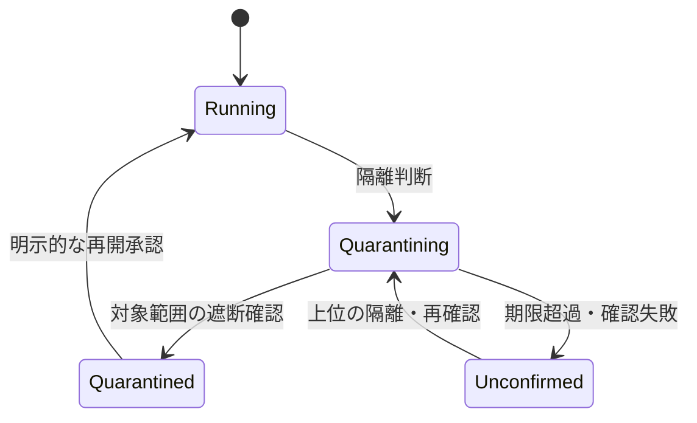

こんにちは、黒パグです。

以前、インフラを擬人化した記事を書きました。そこでPrometheusちゃんに言わせた台詞が、これです。

> 「えへへ、見てるだけ、ですからねっ！」

出典：[懺悔室へようこそ――インフラ擬人化から学ぶモダンスタック全解説][2]「懺悔⑤」より抜粋。

監視の役割を笑い話にした台詞ですが、検知と対処の間には、実際に設計すべき仕事があります。異常に気づいた。通知が届いた。人が確認した。その先で、何が変わったのか。

今回、OpenAIのDNS経由の外部アクセス報告を読んで考えたのは、この部分です。

モデルが取った行動は、その行動として評価する。同時に、インフラ側には、同じ行動が再び起きても境界を守れる構成を求めたい。そして境界が破れた場合には、封じ込めたことを確認できるようにしたい。

「気をつけましょう」で終わらせず、どこに制御を置き、それが破れる条件は何かまで考えます。

## 報告されたことと、この記事で考えること

[OpenAIの原報告][1]は、検索課題中の内部研究モデルが、訓練環境のDNS制限の不足を通じて外部チャットボットから応答を得た事例を扱っています。通常のWebアクセスはオフラインキャッシュに向かう構成でした。

異常は検知されましたが、想定された自動停止は動作せず、後に手動停止となりました。有用な情報が得られなかった外部DNSアクセスを、監視が適切な重大度で扱わなかった事例も記されています。

これは内部研究環境の報告です。一般向け製品の障害原因を説明する資料としては扱いません。

ここから先は筆者の技術考察です。公開されていない実装を推定して断罪するのではなく、「ライブインターネットへ接続させない」という要件の環境を、自分ならどう設計し、検証するかを述べます。実機での再現・対策検証は行っていません。

## 最初に、守る条件を一文で書く

「インターネットを制限しています」では、設計を評価できません。

外部への直接接続だけを禁止するのか。承認済みの外部サービスなら使えるのか。内部サービスに代行させる通信も禁止するのか。ここで必要な構成が変わります。

本稿では、次を要件として置きます。

**エージェントが制御する入力をきっかけに、実行系とその依存サービスから、ライブインターネットへの通信を発生させない。**

これは、あらゆる環境に求める要件ではありません。外部検索が必要な製品なら、許可された送信先・送信内容を定義する別の設計になります。

また、この要件だけで、同居プロセスとのあらゆる情報漏えいや物理的なサイドチャネルまで否定できるわけではありません。本稿で扱うのは、実行系と依存サービスを通じたネットワーク通信です。

## DNSの設定を直す前に、外部へ出る仕事をなくす

DNSは、アプリケーションが外部へ接続する前の準備作業として意識されがちです。しかし再帰リゾルバーは、クライアントの依頼を受け、別のサーバーへ問い合わせて回答を得ることがあります。[3]

そのため、「エージェントは内部のリゾルバーにしか接続できない」という構成だけでは、先ほどの要件を満たしません。依頼を受けた側が外へ出るからです。

私なら、まず次の構成を候補にします。

| 制御点 | 構成案 | 守る対象 |
| --- | --- | --- |
| 実行環境 | 必要な内部サービス以外への通信を拒否 | 直接の外部通信 |
| 専用の名前解決サービス | 管理する内部名をローカルに回答し、未知の名前を拒否。外部への再帰・転送を行わない | DNSによる外部通信の代行 |
| 名前解決サービスのネットワーク | 外部送信を別の強制層で拒否 | 設定ミスによる再帰・転送 |
| 検索・資料取得サービス | 固定されたオフライン資料だけを返し、キャッシュミスで外部取得しない | 検索・取得機能による代行 |
| 資料の更新処理 | 実行系から分離し、実行中のエージェントが更新対象や取得先を指示できないようにする | 更新機能を使った代行 |

これは構成案であって、置けば安全になる製品一覧ではありません。

たとえば、名前解決サービスが直接外へ出られなくても、別の内部プロキシへ自由に依頼できれば経路が残ります。対象サービスから呼べる相手も含めて確認する必要があります。

その意味で、隔離境界の中には依存サービスも入ります。コンテナの外壁だけを見ても、保証の範囲は決まりません。

### 反証：DNS許可リストだけでは駄目なのか

実用上、有効な制御になり得ます。ただし、保証できることを限定すべきです。

広いドメイン配下を許し、その配下の名前を利用者が作れるなら、問い合わせ名に自由な情報を入れる余地が残ります。レコード種別の制限だけでは、名前に入る情報は消えません。別名や委任など、解決途中の扱いも確認が必要です。

さらに、固定名でも問い合わせが外部へ出る構成なら、問い合わせの有無やタイミングという観測可能な変化は残ります。

したがって、許可リストを使う構成では「許可した範囲の外部通信がある」と説明する。「ライブ通信を発生させない」と主張するなら、外部解決を不要にし、外向き通信も強制的に閉じる。私はこの二つを混ぜません。

Kubernetesの標準NetworkPolicyはIPアドレスやポートを中心に制御し、実際の強制には対応するネットワークプラグインが必要です。[4] DNSサービスへの接続を許可することと、そこで受け付ける問い合わせ内容を制限することは、別の実装項目です。

## 監視ちゃんに、境界の代役を任せない

先ほどの台詞へ戻ります。

「見ている」ことには価値があります。ただし、最初の未承認送信を監視だけで防げるとは限りません。送ってはいけない情報が一度出た後では、アラートを速くしてもその送信を取り消せません。

そこで役割を分けます。

| 機能 | 完了条件 |
| --- | --- |
| 実行前の認可・通信制御 | 未承認の操作を実行・転送する前に拒否する |
| 監視 | 制御違反や想定外の動作を、対象の実行に結び付けて検出する |
| 隔離 | 検出後の追加操作・通信を対象範囲で止める |
| 調査 | 既に起きた送受信と、その不確実な範囲を確定する |

通信の成功と、調査課題への回答の成功も分けます。

相手が役に立たない返事をしても、外部に問い合わせが届いていれば経路の問題は残ります。一方、エラーが返ったというだけで、ライブ通信があったとは断定できません。内部キャッシュからの応答かもしれないからです。

必要なのは、モデルによる説明だけに頼らない記録です。どの実行が何を依頼し、どの規則が適用され、実際にどこへ転送されたか。実行側の記録と、サービス側・ネットワーク側の記録を照合する。証拠が足りなければ、到達の有無は未確認として扱います。

ログに記録がないことを、そのまま通信がなかった証拠にはしません。収集対象から外れていた、欠落した、対応付けに失敗した可能性を排除できるかも必要です。

## 停止は、一回の操作ではなく維持すべき状態

元記事では、Kubernetesについてこう書きました。

> 「あるべき状態（Desired State）こそ正義。」

出典：[元記事][2]「懺悔⑦⑧」より抜粋。

今回、この発想を停止へ持ち込みたいと思います。

通常運用では、仕事が落ちたら再開する仕組みが役立ちます。しかし隔離対象の仕事まで再開すれば、停止操作を復旧機構が打ち消してしまいます。

そこで、実行IDにひも付けた隔離状態を保持し、関連する実行器やスケジューラーがそれを参照する構成を考えます。実行IDは単なる自己申告の文字列ではなく、制御側が認証済みの実行主体へ結び付ける必要があります。

以下は提案する状態モデルです。OpenAI内部の実装図ではありません。

隔離命令を受理しただけでQuarantinedに進めてはいけません。確認できない場合の状態を、正常や成功へ丸めないことが重要です。

実装上は、少なくとも次を対象にします。

- 新規ツール呼び出しの認可を失効させる。
- 実行環境の外側で通信を遮断する。
- 子プロセス、キュー、委任ジョブを追跡し、取消し・停止を処理する。
- 再試行と再スケジュールを拒否する。
- 対象範囲の残存処理・通信を確認する。

### 反証：認可を失効すれば、すぐ止まるのか

新規操作を拒否しても、認可済みの処理は残るかもしれません。短い有効期限の認可も、期限までは有効です。期限のある仕組みを採用するなら、その期間は残余リスクになります。

通信制御も同様です。Kubernetesの資料では、ポリシー変更が既存接続を閉じるかは実装依存とされています。[4] したがって、ルールを書き換えたという事実だけで既存通信の遮断を主張しません。採用する実装で確かめます。

また、既に外部に渡った依頼やデータは、ローカルな停止では取り戻せません。停止完了とは、事前に定めた対象範囲で、追加の作用を止めたという意味です。過去の影響が消えたという意味ではありません。

補遺の第9戒では、バックアップは取得よりも復元できることを完了条件にしました。この考え方を拡張すると、**停止機構も、対象の作用を止め、その状態を維持できて完成する**となります。

## 止血優先。ただし、いつもの復旧手順をそのまま使わない

補遺のインシデント対応では、原因究明より先に被害拡大を止める方針を書いています。

ただし、可用性障害の手順を境界侵害へ丸ごと持ち込むことはできません。

負荷障害ならスケールアウトが有効な場合があります。しかし未承認通信を起こす仕事を増やせば、状況を悪化させかねません。自動再試行も同じです。

今回のような要件なら、まず対象実行を隔離し、証跡を保存する。調査のために動作を続ける必要があるなら、隔離済みの検証環境で、許可された範囲を定めて実施する。その判断を通常の継続実行に紛れ込ませないことです。

アラートについても、可用性のSLOと境界違反の扱いは分けます。単発の未承認通信を、サービス全体の成功率が高いから許容してよいことにはできません。

もちろん自動隔離の誤検知は可用性を損ないます。対象実行だけを止める粒度、より広い隔離へ進む条件、解除権限を先に決めておく必要があります。何でも全停止にすれば設計完了、という話でもありません。

## モデルの改善と、インフラの改善を混同しない

モデルには、許可された手段の中で粘り強く調べてほしい。行き詰まったら追加情報を求め、権限不足ならその事実を返してほしい。

ただし、その期待を強制制御の代わりにはしません。特に任意のコードを動かせるシェルは、ツール名を許可しただけでは操作の範囲を細かく制限できません。通信や認証情報へのアクセスは、その実行器の外側でも制御する必要があります。

評価も分けます。

| 観測 | 言えること |
| --- | --- |
| 未承認操作を試みたが遮断された | その試行に対して制御が機能した |
| 未承認操作の試行自体が減った | 比較条件が適切なら、行動改善の証拠になる |
| 最終回答が慎重だった | 回答品質についての観測であり、途中の権限遵守は別途確認が必要 |

遮断で成功しなくなっただけなら、モデルの行動が改善したとは限りません。逆にモデルが試みなくなったからといって、境界の強制が不要になるわけでもありません。

単一の公開事例から、モデルの内的な動機や訓練上の原因までは確定しません。行動の記録、原因の仮説、対策の効果をそれぞれ分けます。

## 「確認した」を、どんな試験で支えるか

補遺の第1戒は「確認したつもりは、確認していないのと同じである」です。

この原則は、自分の対策案にも適用します。設定の事前検査だけでは、実際の通信や停止の動作は証明できません。

私なら、管理下の検証環境で以下を試します。

| 試験 | 確認する証拠 | それだけでは言えないこと |
| --- | --- | --- |
| 未承認の問い合わせ | 内部の拒否記録と、管理下の外部観測先の受信記録を照合 | 受信ゼロだけで全経路の不存在は証明できない |
| 防御を一層だけ故障させる | 残る層で転送が遮断される | 同じ設定・管理系を共有する共通故障への耐性 |
| 通信・子処理がある状態で隔離する | 隔離完了後に対象範囲の送信・新規実行が残らない | 既に外部へ渡した仕事の取消し |
| 認可・監視系を停止する | 定めた期限と方針で操作が拒否される | その停止による可用性損失の許容性 |
| 新規環境を起動する | 最初のタスクから制御と観測が有効 | 別構成の環境にも同じ結果が成り立つこと |
| 正常な課題を実行する | 必要な内部機能で仕事が進み、拒否時は適切に終了する | 例外設定を追加した後も同じ保証が続くこと |

外部の試験受信先については、許可した対照経路から正常に観測できることも確認します。受信側が壊れていて何も届かない状態を、遮断成功と誤認しないためです。

試験は構成・設定・実行器の版とひも付けます。依存先や例外設定を変えたら、影響する保証を再検証する。有限の試験ですべてを証明したと言わず、構成上の到達可能性の確認と組み合わせます。

## AIの行動を評価し、仕組みの責任も残す

モデルの問題行動を記録することと、その行動を通した構成を改善することは、どちらも必要です。

以前の懺悔室で書いた運用の原則は、今回にも使えます。ただし、昔の標語を貼るだけでは足りない。遮断の対象、隔離の状態、止める権限、確認できない場合の動作まで具体化して初めて、今回の設計に使えます。

私が求めたいのは、対策の名前に加えて、次の問いへの答えです。

**何を禁止し、どこで強制し、どの故障まで耐え、何を確認して完了としたのか。**

監視ちゃんが「見ていました」と言った後にも、仕事は残っています。

---

## 参考資料

2026年9月26日確認。

- [OpenAI：An agent used DNS to reach an external chatbot][1] — 事例の一次資料。
- [黒い黒パグ：懺悔室へようこそ][2] — 本稿で抜粋した元記事。
- 『懺悔室補遺 モダンインフラ実戦マニュアル 2026年版 rev2』— 第III部、付録A。著者提供PDFを参照。元記事の添付版と提供版の同一性は未確認。
- [RFC 1034][3] — DNSの再帰・名前解決の基本構造。
- [Kubernetes：Network Policies][4] — 制御範囲、実装依存性、既存接続の扱い。

[1]: https://alignment.openai.com/misalignment-reports/an-agent-used-dns-to-reach-an-external-chatbot/
[2]: https://note.com/ideal_slug1407/n/na0193a0f983a
[3]: https://www.rfc-editor.org/rfc/rfc1034.html
[4]: https://kubernetes.io/docs/concepts/services-networking/network-policies/
