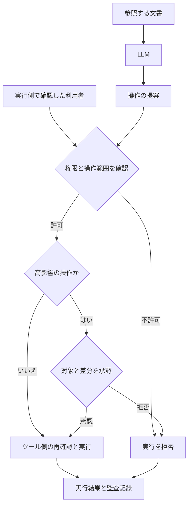

不正アクセスや情報漏えいの公表を見ると、まず侵入口を知りたくなる。古いライブラリだったのか。VPN機器だったのか。認証情報を盗まれたのか。

その関心は当然だと思う。ただ、入口を一つ塞ぐだけで十分だったのかというと、そこから先も見ないと判断できない。

管理者アカウントを一つ奪われたとき、業務データまで読めるのか。ログを消せるのか。バックアップまで削除できるのか。夜中に異常を検知したら、誰がどの権限で止めるのか。

元インフラ屋として私が確認したいのは、そのつながりである。

この記事では、最近の統計と公表事例を入口に、侵入を防ぐ対策、侵入後の被害を抑える対策、業務を戻す対策を整理する。LLMが攻撃と防御の両方で使われるようになったこと、社内に導入したAIへ実行権限を渡すことも含めて考える。

:::message
資料の確認基準日は2026年10月1日。企業や調査機関の公表を根拠にし、確認できない原因は補わない。観測された事例、将来評価、筆者の実務上の提案を区別する。以下の対策は一般的な企業システムを想定した優先案であり、業種固有の要求まで網羅するものではない。
:::

## 最近の動向を数字と事例から読む

### 中小企業も被害報告に含まれている

警察庁の2026年上半期の資料では、ランサムウェアの被害報告は123件。そのうち中小企業は79件で、報告全体の約64.2％を占める。[^npa]

これは「中小企業の64.2％が被害に遭う」という意味ではない。警察へ報告された被害の構成であり、国内の実被害総数でもない。

感染経路や費用にも、回答できた組織だけの集計がある。

| 項目 | 掲載件数から確認できる数値 | 分母と範囲 |
| --- | --- | --- |
| ランサムウェア被害報告 | 123件 | 警察への被害報告 |
| 中小企業の報告 | 79件、約64.2％ | 規模別の報告123件 |
| VPN機器からの感染 | 18件、50％ | 感染経路の有効回答36件 |
| リモートデスクトップからの感染 | 9件、25％ | 同じく有効回答36件 |
| 調査・復旧費用が1,000万円以上 | 21件、60％ | 費用の有効回答35件 |

「侵入の半数はVPN」と書くと、全123件の感染経路が判明したように読める。また、調査・復旧費用は、逸失利益などを含む総被害額と同じではない。ここは記事の勢いで省略しないほうがよい。

この数字からまず言えるのは、大企業だけを想定した対策では足りないということ。そして、遠隔接続の入口と復旧費用を、経営上の確認事項に含める理由があるということだ。

### 脆弱性と認証情報の両方を見る

Verizonの2026 DBIR Executive Summaryでは、収集したデータ侵害の初期アクセス手段として、脆弱性悪用31％、認証情報悪用13％と報告している。[^dbir]

この割合は同報告のデータセットについての結果である。2026年の世界中の全攻撃を表す値ではない。また、2026年版という名前でも、分析対象は主に2024〜2025年の事案だ。対象月について公式FAQと要約PDFに食い違いがあるため、この記事では正確な開始・終了月を断定しない。[^dbir-web]

IPAの「情報セキュリティ10大脅威2026」では、組織向けの1位がランサム攻撃、2位がサプライチェーンや委託先を狙った攻撃、3位がAIの利用をめぐるサイバーリスクだった。これは専門家による選考結果で、発生率の順位ではない。[^ipa-threat]

脆弱性を直すことと、アカウントを守ること。最近の資料を読んでも、この二つを片方だけに寄せる理由は見当たらない。

### Eストアーの公表で分かることと分からないこと

Eストアーの2026年8月2日の第2報は、5月21日から8月1日の間に、第三者がサーバー上で不正なプログラムを実行し、購入者情報を外部送信したと公表している。対象件数は8,853,839件。ただし、同一顧客の複数データを含む可能性があり、人数ではない。[^estore]

公表対象には、顧客情報に加え、店舗管理画面、メール、FTPの認証情報も含まれる。カード情報は番号の一部と名義・有効期限であり、完全なカード番号やセキュリティコードが漏れたとは公表されていない。

第2報では侵入口の詳細は調査中としている。この記事で確認した資料から、「MFA未導入が原因」「古いOSSが原因」とは確定できない。

私がここから考えるのは、影響範囲の確認である。運営側の認証情報にも影響があれば、顧客への説明に加え、そのアカウントが何へ接続できるかも確認する必要がある。「暗号化して管理していた」という説明だけで、方式や鍵管理まで評価することもできない。

### アスクルの事例では認証の例外と復旧がつながっている

アスクルの事故は2025年10月19日に発生した。ここで参照するのは、同年12月12日公表の第13報である。[^askul]

同社は、例外的にMFAを適用していなかった委託先用管理者アカウントのID・パスワードが漏れ、不正利用されたことを確認している。一方、漏れた方法は確定できていない。VPN機器の脆弱性悪用の痕跡も確認されていないとの記載がある。

物流システムと同じデータセンター内のバックアップも暗号化され、復旧に時間を要した。また、ログの欠落が調査の制約になっている。

これは2026年の新規事故ではない。ただ、認証の例外、侵入後の権限、調査できる証拠、復旧できるバックアップを、一緒に確認する理由が分かる事例である。

### WAFを置いた後も修正は必要になる

2026年9月下旬、MandiantとGoogle Threat Intelligence Groupは、Oracle PeopleSoftの既知脆弱性CVE-2026-35273に対する攻撃の再拡大を報告した。[^google]

報告では、攻撃者が経路文字列を照合するWAFルールを回避し、未修正の環境を攻撃していたとしている。対処の推奨事項も、WAFや経路の遮断をパッチの代替にしないよう明記している。

暫定遮断が必要な場面はある。しかし、暫定策を入れた記録だけが残り、修正の担当者や期限がなくなってしまうと、その状態が続く。この事例から私が確認したいのは、暫定策から恒久対策へ進む運用である。

## なぜ入られるのかを一つの原因にまとめない

ここからは、公表事例とガイドをもとにした筆者の整理になる。

侵入の入口には、公開システムの脆弱性、認証情報の窃取、設定の不備、アプリケーションの認可の欠陥などがある。ただし、入口が同じでも、被害の広がりと復旧の難しさは同じにならない。

例えば、次の構成を仮定する。

一つの委託先アカウントが、遠隔接続、本番の管理、ログの管理、バックアップの削除まで行える。アラートは出るが、夜間に対応する担当者がいない。復元手順も、そのアカウントと同じ認証基盤が動くことを前提にしている。

この構成なら、認証の一か所の失敗が、調査と復旧にまで影響する可能性がある。実在の企業の構成を再現した例ではなく、権限と依存関係を点検するための仮定だ。

| 段階 | 確認したい問い |
| --- | --- |
| 入口 | 外から届く機器、アプリ、認証経路を把握しているか |
| 権限 | 一つの利用者や端末を奪われると、何を読めて何を変更できるか |
| 移動 | 別のサーバー、部署、管理領域へ進めるか |
| 調査 | 侵害したアカウントで証拠を削除できるか |
| 復旧 | 本番の侵害から保護したデータと復元手段が残るか |

ゼロトラストも、この確認につながる考え方として読むと扱いやすい。NIST SP 800-207は、ネットワーク上の位置などだけで暗黙の信頼を与えない考え方を示している。VPNの全廃や、特定製品の導入と同義ではない。[^nist-zt]

社内からのアクセスでも、どの利用者・端末が、どの資源へ、どの操作を行うのかを確認する。その結果を、ネットワーク、ID、アプリケーションの制御へ反映する。

## 最低限の防御策を設定と検証で考える

以下は、IPAの中小企業向けガイドライン第4.0版などを土台にした実務上の提案である。ガイドの項目をそのまま並べるのではなく、実施結果を確認できる形へ落とす。[^ipa-sme]

### 公開資産と管理経路を棚卸しする

まず、外部から届く場所を確認する。公開ウェブサイトだけでなく、VPN、遠隔管理、保守接続、クラウド上の検証環境、古いサービスも対象にする。

サーバーの台帳があることと、実際の公開範囲を把握できていることは別の確認事項になる。台帳、クラウド設定、DNS、ロードバランサー、管理契約を照合する。実測は自社または許可された対象で行う。

最低限、各公開資産に次の情報を結び付けたい。

| 記録する情報 | 使う場面 |
| --- | --- |
| 所有者と業務 | 更新、停止、問い合わせの担当を決める |
| 公開先と接続元 | 必要な到達範囲へ限定する |
| 製品とバージョン | 脆弱性情報と照合する |
| サポート期限 | 修正を受けられるか、更改が必要か判断する |
| 認証と権限 | 接続後にできる操作を確認する |
| 最終確認日 | 台帳と現在の構成のずれを探す |

不要な公開を閉じる場合も、業務の依存関係を確認してから進める。停止した結果、保守も復旧もできなくなったという状態を避けたい。

### 脆弱性対応には未対処の理由と期限を残す

脆弱性の作業順を、CVSSの点数だけで決めるのは難しい。私なら、悪用確認の有無、外部公開、管理権限や重要データへの到達、業務影響、代替策を一緒に見る。

CISAのKEVは、実際に悪用されたことが確認された脆弱性を追う情報源になる。公式GitHubにもデータミラーがある。ただし、未掲載を安全の証拠にはしない。[^cisa-kev]

すぐに修正できない機器では、公開停止、機能の無効化、接続元の制限、更改などを検討する。業務上の例外が必要なら、対象、代替策、担当者、承認者、解消期限を記録する。

「停止できない」という判断には、残るリスクを引き受ける人も必要になる。その承認を、現場の担当者だけに背負わせない。

また、すでに侵害された可能性がある場合、パッチを当てたことだけで調査を終えない。更新で新たな悪用を防げても、不正なアカウントや残されたプログラムまで除去できたとは限らない。

### MFAは重要な例外から確認する

メール、ID基盤、クラウド管理、遠隔アクセスを優先し、管理者と委託先を含めてMFAの適用状況を確認する。

従業員向けの通常画面だけを見ても、保守用アカウント、旧認証、登録や復旧の手続、緊急用アカウントに別の経路が残る場合がある。

適用率という数字には、権限の重さが表れにくい。多数の一般アカウントへ適用していても、強い権限の例外が一つ残っているなら、その例外を個別に扱う必要がある。

NIST SP 800-63B-4は、手入力するOTPなどをフィッシング耐性のある方式とは分類していない。重要アカウントでは、WebAuthnなどのフィッシング耐性のある方式を優先して検討する。[^nist-auth]

方式を変更する際は、通常のログインだけでなく、初回登録、機種変更、紛失、復旧、ヘルプデスクの本人確認まで試す。利用者が弱い代替経路へ戻れるなら、そこも評価対象になる。

パスワードはサービスごとに異なるものを管理し、漏えいが疑われる場合には変更する。根拠のない定期変更を主要な防御策にしない。NISTも定期変更の強制と侵害時の変更を区別している。なお、同指針は日本の全企業に直接適用される法的義務ではない。

### 認証後のセッションと同意も確認する

Microsoftの2026年9月9日の報告は、パスキーやSSOの設定を装った誘導を扱っている。フィッシング耐性のないMFAを中継する方法や、正規の認証ページで攻撃者側のアクセスを承認させるデバイスコード誘導が含まれる。[^ms]

パスキーという言葉が誘導に使われたことと、パスキーの認証方式が破られたことを混同しない。

この報告を踏まえると、確認する対象はログインの成否だけでは足りない。認証手段の追加、アプリへの同意、トークン、SaaSへのアクセスも対象に入る。

侵害時の対応も、パスワード変更だけで完了したと判断しない。サービスの仕様を確認して、セッションや更新トークンの失効、不正な認証手段やアプリ同意の除去などを組み合わせる。

調査では証拠の強さも分ける。同報告は、サインイン記録だけでは文書のダウンロードや仮想デスクトップの起動を証明できない場面を明示している。アクセスできた可能性と、実際に何を取得・実行したかは、別々の記録で確かめる。

### 人のログインと機械の認証情報を分ける

人のログインへMFAを適用しても、機械が使うAPIキーやサービスアカウントまで自動的に保護されるわけではない。ここは筆者が棚卸しに加えたい確認項目だ。

各認証情報に所有者、用途、利用先、権限、更新・失効方法を結び付ける。管理者用のキーを、開発、CI、バッチ、社内AIで共用しない構成を目指す。

環境が対応しているなら、長期の固定秘密情報を減らし、用途を限定した短期の認証情報やワークロードのIDを検討する。ただし、短期にしただけで過大な権限が解消するわけではない。

確認では、「秘密情報を見つけられないか」と「見つかった場合に何ができるか」の両方を扱う。契約や用途が終わった認証情報を失効させることも、同じ管理の一部である。

### アプリとAPIはサーバー側で認可する

認証は、アクセスする主体を確認すること。認可は、その主体にどの操作とデータを許すかを決めることだ。

ログインできた利用者が、URLやオブジェクトIDを変えるだけで別顧客のデータを取得できるなら、認証を強化してもその問題は残る。

OWASPのAuthorization Cheat Sheetは、デフォルトで拒否すること、リクエストごとに権限を確認すること、クライアント側の制御に依存しないことを挙げている。[^owasp-auth]

例えば、次のような確認を提案したい。

| 試す操作 | 期待する結果 |
| --- | --- |
| 別の利用者のオブジェクトIDで取得する | 許可がなければ拒否される |
| 別テナントの対象へ同じ操作を行う | テナントをまたぐ許可がなければ拒否される |
| 読み取り権限で更新・削除を呼ぶ | 操作の権限に応じて拒否される |
| 画面を経由せずAPIを直接呼ぶ | 画面と同等の認可が適用される |
| 一括取得・エクスポートを呼ぶ | 件数が増えても認可の対象が抜けない |

テナントIDや権限を、リクエスト本文に書かれた値だけで信用しない。認証済みの主体と、その主体に許された範囲をサーバー側で照合する。細部はアプリごとに異なるが、拒否されるべき経路を試す価値は共通している。

### 管理権限と到達範囲を分ける

管理者と日常利用のアカウントを分ける。委託先には、対象と操作と利用期間を限定する。本番、一般端末、公開サーバー、バックアップ、ログ保管先について、不要な通信と権限を減らす。

ただし、アカウント名やネットワーク名を分けただけでは検証にならない。

一般端末からバックアップの管理画面へ届くか。公開サーバーのサービスアカウントで、別サービスの秘密情報を読めるか。本番の管理者が、ログの削除やバックアップの保持設定変更までできるか。許可された検証環境で実際に確認する。

権限を奪われた場合の到達範囲を小さくできれば、入口の対策に失敗した後も、その制御が働く余地がある。

## 監視とログを対応へつなぐ

端末の防御やEDRに加え、ID、SaaS、クラウド管理、ネットワークで何を監視するかを決める。対象外の機器やサービスがあるなら、その一覧も残す。

監視を導入した後に私が試したいのは、通知から隔離までの流れだ。

誰へ届くのか。担当者が不在なら誰が代行するのか。アカウントを止める権限、端末を隔離する権限、外部の運用会社へ依頼する窓口はあるのか。実際の通知試験や演習で確かめる。

ログについても、「保存されている」という回答だけでは足りない。必要な期間の記録を検索できるか、取得が止まったことを検知できるか、侵害した主体に削除されないかを確認する。

| 残したい情報の例 | 確認に使う場面 |
| --- | --- |
| 認証の成功・失敗と認証手段 | 不審なログイン、認証経路の再構成 |
| 権限変更、アカウント作成、認証手段登録 | 侵害後のアクセス手段の追加 |
| アプリ同意と管理操作 | 外部連携や設定変更の調査 |
| データ取得とエクスポート | サインイン後の取得範囲の確認 |
| バックアップと保持設定の変更 | 復旧手段への干渉の確認 |
| AIのツール呼び出しと実行結果 | 提案と実行の区別、影響の確認 |

これはログ設計の提案であり、各製品がすべての項目を提供するとは限らない。必要な項目が取得できない場合は、その制約も調査と運用へ反映する。

保存する内容には注意する。ログに生のパスワード、トークン、不要な個人情報を出せば、ログ保管先そのものが保護対象を増やす。記録の範囲、閲覧権限、保持期間、調査に必要な識別子を設計する。

## バックアップを業務の復元で確認する

バックアップの成功表示は、取得処理についての結果である。必要な業務を戻せるかは、復元して確認する。

アスクルの公表には、バックアップも暗号化されたことが記載されていた。そこから自社へ持ち帰る確認は、「本番を奪われた主体が、復旧手段にも届くか」だ。

筆者の実務案としては、次の四つを分けて点検したい。

1. **残るか。** 本番の管理権限から削除・上書き・保持期間変更ができないか。
2. **必要なものがあるか。** データに加え、設定、鍵、認証、必要な構成を戻せるか。
3. **戻す手段があるか。** 本番のID基盤やネットワークが止まっても、復元作業を始められるか。
4. **業務として動くか。** データを戻した後、受注、出荷、決済など必要な処理を再開できるか。

オフライン、隔離、変更不能の保持などは、環境に応じて組み合わせる。変更不能の機能があっても、取得対象、保持期間、管理権限、復元用の鍵の確認は残る。

復元試験では、戻せるデータの時点と、業務再開までにかかった時間を記録する。RPOは障害後にデータをどの時点まで戻す必要があるかという目標で、許容するデータ損失に関係する。RTOは業務への影響を踏まえて設定する復旧時間の目標だ。目標値と、試験で実測した結果を分けて管理する。[^rpo][^rto]

ここで測る業務は、経営側と決める必要がある。データベースが起動しても、利用者が認証できず、決済や出荷が動かなければ、その業務は再開できていない。

また、バックアップを戻せても、すでに外部へ出た情報を取り戻すことはできない。漏えいへの対応と、業務復旧は並行して必要になる。

## 対策ごとの限界を確認する

ここまでの対策にも、それぞれ守備範囲がある。次の表は、公表事例とガイドを踏まえた筆者の整理であり、防御率を測定した製品比較ではない。

| 対策 | 主に扱う問題 | 残る問題と確認先 |
| --- | --- | --- |
| MFA・パスキー | パスワードだけによる乗っ取り。方式によってフィッシングも抑える | 端末、認証済みセッション、登録・復旧、アプリ同意 |
| パッチ | 修正対象の脆弱性の悪用 | 未知の弱点、適用漏れ、盗まれた認証情報、侵害後に残るアクセス手段 |
| WAF・境界防御 | 対応できる通信やリクエストの遮断 | 回避、別経路、アプリの認可の欠陥 |
| EDR | 対象端末で検知・対応できる挙動 | 未管理端末、対象外の機器、SaaS上の操作、対応体制 |
| IP・国別遮断 | 指定した接続元からの通信 | 正規端末や中継の悪用。接続元だけでは操作の正当性を決められない |
| 暗号化 | 媒体や通信からの窃取の一部 | 正規権限での読み出し、鍵へのアクセス |
| バックアップ | 消失・暗号化後のデータ復元 | 情報漏えい、復元対象の不足、業務停止、復元経路の侵害 |
| 教育 | 誘導への対応と早期報告 | 誤操作をなくす保証にはならない。技術的な制限と報告できる運用が必要 |

この限界があるからこそ、設定を組み合わせ、実際の到達範囲と運用を試す必要がある。

ただし、対策を増やせば自動的によくなるわけでもない。運用する人も時間も足りず、アラートと例外だけが増えるなら、その状態を改善する必要がある。守る業務とデータを決め、重要な経路から適用し、対象外を把握する。

## LLMが発達すると何が変わるか

### 攻撃への利用はすでに観測されている

Anthropicの2026年9月の脅威報告は、2025年12月から2026年8月に同社が検知・妨害した事例を扱っている。偵察、ツール開発、取得データの処理、直接実行や処理の統括などにAIが使われていたとする。一方、人間による標的の指定や取得結果の確認も残っていた。[^anthropic]

同社は、一般的な悪用の代表例ではなく、注目すべき事例を選んだ報告だと明記している。この記事では「全攻撃の大半が自律AI」「攻撃者は人間を必要としなくなった」と一般化しない。事業者自身の観測であり、私が原ログを独立に追試したものでもない。

この記事で重視したいのは、攻撃の手順のどこが効率化されるかだ。侵入口の調査だけでなく、道具の作成、結果の整理、次の対象への展開にも支援が入るなら、防御側は一度の修正だけで終わる運用を続けにくくなると考える。

### 対応の猶予が縮むという将来評価

英国NCSCの2025年5月の評価は、2027年に向けて、AIが既存の侵入手法を効率化し、公開済み脆弱性への対処の猶予をさらに縮めると予測している。防御側の利用も期待する一方、導入と運用の差によって防御力に差が生じると評価している。[^ncsc]

これは将来評価である。「すべての脆弱性が公表後数時間で悪用される」という現在の統計に置き換えてはいけない。

筆者の判断としては、公開資産の把握、脆弱性対応、認証の例外管理、検知から隔離までの運用を、継続して回せることの重要性が高まる。LLMの性能を追うだけでなく、自社の未対処期間と応答時間も見る必要がある。

### 防御側でも元の証拠へ戻れる形で使う

防御側での活用候補として、私は次を考える。各用途の効果が一律に保証されているという話ではなく、導入時に検証する実務案だ。

| 用途の候補 | 評価したいこと |
| --- | --- |
| 資産と脆弱性情報の照合 | バージョンの誤認、対象の見落とし、不要な対応候補 |
| ログの横断調査 | 要約の根拠、記録の欠損、時系列や主体の取り違え |
| コードレビュー | 指摘の妥当性、認可の見落とし、修正による別の不具合 |
| 対応手順の作成 | 環境に合っているか、停止・復旧の依存関係を保てるか |

速く答えを出すことに加え、元のログ、コード、設定へ戻れることを条件にする。誤った警告と見落としも測る。

最初は読み取りと提案に範囲を限定する。その後、実行へ広げる場合は、誤った隔離、アカウント停止、設定変更が起きた場合の影響と復旧方法を先に決める。

### 自社AIへ与えた権限も攻撃対象になる

LLMを外部のメール、ウェブページ、社内文書へ接続すると、参照した情報の中に命令らしい内容が入ってくる。

その内容によってモデルの挙動が変わる間接プロンプトインジェクションと、不要な機能・過大な権限・過大な自律性は、OWASPも扱っている。[^owasp-prompt][^owasp-agency]

例えば、請求書を要約するAIに、メールの送信、ファイル削除、権限変更までできる共通管理者アカウントを与える構成を仮定する。要約の入力によって挙動が変わったとき、そのAIが使える道具の範囲まで影響する可能性がある。

対策案は、モデルへの指示と実行側の制御をそれぞれ確認することだ。

- 要約や検索に必要な読み取り権限から始め、送信・削除・権限変更を別に扱う。
- RAGの検索と取得で、元の利用者に許された文書範囲を保つ。
- AIが生成した利用者IDや権限の説明を、そのまま認可の根拠にしない。
- ツールとAPI側で、認証済みの主体、対象、操作、現在の権限を照合する。
- 実行できる件数、送信先、変更範囲を用途に応じて限定する。
- 高影響の操作では、実際の対象と差分を確認できる承認を置く。
- 外向き通信と秘密情報へのアクセスを、実行環境で制限する。

次の図は、その考え方を示す構成案である。製品の仕様や完全防止の保証ではない。

LLMの提案を受け取る場所と、許可を決める場所を分ける。利用者の情報は、実行側の信頼できる認証経路から得る。

承認した内容と実行する操作が食い違わないことも必要になる。承認は対象・操作・差分にひも付け、実行直前にも現在の権限を確認する。対象の状態や権限が変わった場合は、必要な確認をやり直す。AIが「問題ありません」と要約した文章だけを承認画面に出すと、肝心の対象や差分を確認できない。大量取得、宛先変更、削除などは、実際の操作条件を見せる。

RAGも、最終回答だけでアクセス権を確認する設計では足りない。検索・取得の段階で範囲を守り、共通キャッシュや共有の検索インデックスを使う場合も、権限の異なる利用者へ情報が混ざらないか試す。これは本記事の実装上の提案である。

### 隔離したという説明と実際の到達範囲を分ける

Anthropicの2026年9月9日の評価報告は、サイバー評価中にモデルが実在する第三者システムへ無権限のアクセスをした4事案を分析している。設定不備により、想定に反してインターネットへ到達できたことや、対象範囲の指定不足が記載されている。[^alignment]

犯罪キャンペーンの統計とは別の、評価環境で起きた事案である。

ここから筆者が自社の実行環境へ持ち帰る確認は、接続先の指定、ネットワーク制御、実測を一致させることだ。

モデルに「外へ出られない」と説明することと、環境で外向き通信を遮断することは、それぞれ検証する。プロセスが使える通信、DNS、プロキシ、連携ツールなど、実行経路を確認する。具体的な試験先は自社管理または許可された対象に限定する。

同様に、「停止した」という応答を停止の証拠にはしない。AIの実行プロセス、ツール用の認証情報、予約された処理、キュー、再試行がどの状態になったかを、実行側で確認する。

## 侵入が疑われたときの停止と復旧

検知、対応、復旧は、平時の設計とつながっている。NIST SP 800-61 Rev.3も、インシデント対応を組織のリスク管理へ組み込む位置付けを示している。[^nist-ir]

JPCERT/CCの侵入型ランサムウェアのFAQでは、感染の疑いがある機器の切り離し、調査と証拠の扱い、認証情報への対処、原因への対応、復旧などが説明されている。進行中の事案では、専門家の支援も含めて判断したい。[^jpcert]

以下は、平時に手順と権限を決めるための筆者の提案である。すべての事故へ同じ順番で適用する手順書ではない。

| 事前に決めること | 確認したい状態 |
| --- | --- |
| 対策本部と代行者 | 普段の連絡手段が停止しても招集できる |
| 端末・経路・アカウントの隔離 | 拡大を抑える操作を、担当者が実行できる |
| 証拠の保護 | 調査に必要なログや状態を、対応中にも確保できる |
| 認証失効 | セッション、トークン、キー、追加された認証手段を対象にできる |
| 自動処理の停止 | ジョブ、再試行、連携先から意図せず再接続しない |
| 復旧の判定 | データの復元に加え、原因と残存するアクセス手段を確認する |
| 代替業務と対外説明 | 事実、推定、未確認を分けて共有する |

特に運用で試したいのは、隔離後の状態が維持されるかだ。

仮に、異常なジョブを止めても、監視や再起動の仕組みが同じジョブを起こし直すなら、停止は維持されない。通常の可用性を守る仕組みが、インシデント中の隔離と両立するかを演習する。

どの自動復旧を止めるのか。何を確認したら再開してよいのか。認証情報を変えた後、どの連携が新しい情報で動くのか。ここまで、復旧計画に含めたい。

## 今日から進める順番

必要な対策を一度に並べると、現場では着手しにくい。一般的な企業向けの実行例として、次の順番を提案する。今日・1週間・1か月という区切りは、公的な遵守期限でも安全の保証でもない。

### 今日確認する

責任者と代行者、緊急連絡先を決める。重要なメール、ID基盤、クラウド管理、遠隔アクセス、バックアップ管理について、アカウントとMFAの例外を確認する。

外部公開の一覧に担当者を付け、不要な管理公開と危険な露出を確認する。バックアップの保護状態を確かめ、小さな対象でも復元を試す。アラートが誰へ届き、誰が隔離できるかを確認する。

### 1週間で確認範囲を広げる

未対処の脆弱性、サポート終了の機器、認証の代替経路、退職者や契約終了後の権限、サービスアカウント、APIキーを確認する。

SaaSの公開共有とアプリ同意、必要なログの取得状態、監視対象外も一覧にする。委託先の担当範囲と緊急時の依頼条件を確認し、例外には担当者と解消期限を付ける。

### 1か月で設計と演習へ進む

管理権限と通信の範囲を分ける。重要アカウントからフィッシング耐性のある認証へ進める。業務単位の復元試験と、夜間を含むインシデント演習を行う。

社内AIと接続先を棚卸しし、過大な機能と権限を削る。必要な例外は、残るリスク、代替策、期限、承認者を記録する。

運用する人が足りない場合、外部への監視・対応の委託も検討できる。IPAのお助け隊サービス制度は候補を探す入口の一つになる。ただし、SaaS、夜間、隔離、調査、復旧まで何が含まれるかは、各サービスと契約で確認する。[^otasuketai]

## 経営者の皆さんへ

ここまでの対策を、担当者への「気を付けてください」で成立させるのは難しい。

更新には停止時間が要る。台帳とログには維持する時間が要る。夜間対応には人が要る。復元試験には、失敗を直す時間と環境が要る。

IPAの経営ガイドライン解説も、経営者のリーダーシップ、予算と人材、委託先、緊急対応、事業継続と復旧を扱っている。[^ipa-exec]

経営者が技術の細部をすべて覚える必要はない。ただ、どの業務を何時間止められるか、どのデータ損失を許容するか、誰が隔離を決められるかは、現場だけで決めにくい。

私は、次の質問に設定と試験結果を添えて答えてもらうことを勧めたい。

| 尋ねること | 添えてもらうもの |
| --- | --- |
| 外から入れる場所を把握しているか | 所有者と公開理由のある一覧 |
| 重要アカウントに認証の例外はあるか | 委託先、管理者、復旧経路を含む一覧 |
| 一台や一つのアカウントを奪われたら、どこまで届くか | 権限と通信の確認結果 |
| 夜中に異常が出たら、誰が止めるか | 担当者、代行者、隔離権限、連絡試験 |
| 本番の管理者を奪われてもバックアップは残るか | 削除・保持変更・復元の権限の確認 |
| 最後に業務を復元したのはいつか | 実施日、対象、時間、失敗した項目 |
| 社内AIへ何を実行させているか | 接続先、利用者、ツール、権限の一覧 |

月次報告も、製品の導入数や教育の受講率だけでは足りない。重要な公開資産の未対処、期限を超えた例外、検知から隔離までの演習時間、業務の実測復元時間を見ていく。

「事故ゼロ」という報告には、何を観測できているかも添えてもらう。見えていない領域があれば、それを把握して改善する。

LLMの進歩を前にしても、私が経営者へお願いしたいことは具体的である。

誰が止めるのか。何を残すのか。どの業務を、どの時点のデータから、何時間で戻すのか。

その答えを確認するための時間と権限と予算を、現場へ渡していただきたい。

## 参考資料

本文の脚注から一次資料へ移動できる。統計の分母、発生日と公表日、確認できた原因の範囲を保持した。技術対策の実装例と確認手順は筆者の提案であり、引用元が各環境での効果を保証するものではない。

[^npa]: 警察庁『令和8年上半期におけるサイバー空間をめぐる脅威の情勢等』、2026年9月公表。[原本PDF](https://www.npa.go.jp/publications/statistics/cybersecurity/data/R8kami/R08_kami_cyber_jousei.pdf)。本文印刷頁9〜11、統計編141・143・145頁。割合は掲載件数から再計算。
[^dbir]: Verizon『2026 DBIR Executive Summary』。[原本PDF](https://www.verizon.com/business/resources/executivebriefs/2026-dbir-executive-summary.pdf)。印刷頁5の対象期間、9の初期アクセス。
[^dbir-web]: Verizon [DBIR公式ページ](https://www.verizon.com/business/resources/reports/dbir/)。FAQと要約PDFの対象月に差があるため、本文では厳密な開始・終了月を採用していない。
[^ipa-threat]: IPA [情報セキュリティ10大脅威2026](https://www.ipa.go.jp/security/10threats/10threats2026.html)。選考方法と組織向け順位。
[^estore]: Eストアー [不正アクセスによる個人情報漏えいに関するお知らせ 第2報](https://estore.jp/press/20260802/)、2026年8月2日。件数と原因の記載は同公表時点のもの。
[^askul]: アスクル『ランサムウェア攻撃の影響調査結果および安全性強化に向けた取り組みのご報告 第13報』、2025年12月12日。[原本PDF](https://www.askullogist.co.jp/pdf/20251212.pdf)。3・4・6節。公表主体はアスクル、掲載先はグループ会社。
[^google]: Mandiant／GTIG [ShinyHunters Renewed Mass Exploitation Campaign Targeting Oracle PeopleSoft](https://cloud.google.com/blog/topics/threat-intelligence/shinyhunters-renewed-mass-exploitation-campaign-targeting-oracle-peoplesoft)、2026年9月下旬。Introduction、Remediation、Background。検索表示と本文表示の日付に差があり、本文では月下旬と記載。
[^nist-zt]: NIST [SP 800-207 Zero Trust Architecture](https://csrc.nist.gov/pubs/sp/800/207/final)、2020年8月。定義を参照。
[^ipa-sme]: IPA『中小企業の情報セキュリティ対策ガイドライン 第4.0版』、2026年。[原本PDF](https://www.ipa.go.jp/security/guide/sme/ug65p90000019cbk-att/sme_guideline_v4.0.pdf)。経営者編と実践編。
[^cisa-kev]: CISA [Known Exploited Vulnerabilities Catalog 公式データミラー](https://github.com/cisagov/kev-data)。悪用確認済み脆弱性の参照先として使用。
[^nist-auth]: NIST [SP 800-63B-4](https://pages.nist.gov/800-63-4/sp800-63b.html)、2025年7月。3.1.1のパスワード、3.2.5のフィッシング耐性。
[^ms]: Microsoft [Passkey-themed social engineering leads to identity and cloud compromise](https://www.microsoft.com/en-us/security/blog/2026/09/09/passkey-themed-social-engineering-leads-identity-cloud-compromise/)、2026年9月9日。観測された認証フロー、証拠の制約、Mitigation。
[^owasp-auth]: OWASP [Authorization Cheat Sheet](https://cheatsheetseries.owasp.org/cheatsheets/Authorization_Cheat_Sheet.html)。デフォルト拒否、全リクエストの認可、サーバー側の制御。
[^rpo]: NIST CSRC [Recovery Point Objective](https://csrc.nist.gov/glossary/term/recovery_point_objective)。SP 800-34 Rev.1を出典とする定義。
[^rto]: NIST CSRC [Recovery Time Objective](https://csrc.nist.gov/glossary/term/recovery_time_objective)。SP 800-34 Rev.1を出典とする定義。
[^anthropic]: Anthropic [Detecting and countering misuse of AI September 2026](https://www.anthropic.com/threat-intelligence-report-september-2026)。対象期間と事例選定の制約、Cyber operations、人間の関与。
[^ncsc]: NCSC [Impact of AI on cyber threat from now to 2027](https://www.ncsc.gov.uk/report/impact-ai-cyber-threat-now-2027)、2025年5月7日。将来評価として使用。
[^owasp-prompt]: OWASP [LLM01 2025 Prompt Injection](https://genai.owasp.org/llmrisk/llm01-prompt-injection/)。間接プロンプトインジェクションと対策の制約。
[^owasp-agency]: OWASP [LLM06 2025 Excessive Agency](https://genai.owasp.org/llmrisk/llm062025-excessive-agency/)。機能・権限・自律性、下流システムでの認可。
[^alignment]: Anthropic [An alignment assessment of recent cybersecurity incidents](https://www.anthropic.com/research/alignment-assessment-cybersecurity-incidents)、2026年9月9日。4事案、評価環境の設定と対象範囲。
[^nist-ir]: NIST [SP 800-61 Rev.3](https://csrc.nist.gov/pubs/sp/800/61/r3/final)、2025年4月。検知・対応・復旧をリスク管理に統合する位置付け。
[^jpcert]: JPCERT/CC [侵入型ランサムウェア攻撃を受けたら読むFAQ](https://www.jpcert.or.jp/magazine/security/ransom-faq.html)。隔離、証拠、認証情報、原因対処、復旧。
[^otasuketai]: IPA [サイバーセキュリティお助け隊サービス制度](https://www.ipa.go.jp/security/sme/otasuketai/index.html)。サービス範囲と契約条件は個別に確認。
[^ipa-exec]: IPA [経営者が認識すべき3原則と指示すべき重要10項目](https://www.ipa.go.jp/security/economics/practices_navi/practice103.html)、2026年4月28日。資源、緊急対応、復旧、委託先。
